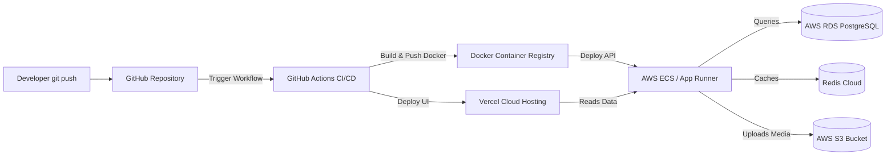

# Production Stack, Deployment Blueprint, & New Modules Plan

This document details the exact **technology stack**, **deployment workflow**, and **new business modules** required to build a fully working, production-ready real estate portal.

---

## 1. Technology Stack (Tech Stack)

To build a secure, fast, and SEO-friendly portal, we will use a split architecture (Frontend + Backend + Databases).

### A. Frontend (Client-side)
* **Framework**: **Next.js (React Framework)**
  * *Why*: Next.js supports Server-Side Rendering (SSR). This is critical for real estate portals because Google/Bing search engines need to index property listings so they appear in search results.
* **Language**: **TypeScript**
  * *Why*: Prevents runtime bugs by adding strict types to properties, user profiles, and API responses.
* **Styling**: **Tailwind CSS + Headless UI**
  * *Why*: Fast, responsive styling with clean layouts and pre-built components for sliders, dropdowns, and tabs.

### B. Backend (Server-side API)
* **Framework**: **Node.js (NestJS or Express)** OR **Python (FastAPI)**
  * *Why*: Node.js handles thousands of concurrent requests (like users browsing properties) very efficiently. FastAPI is excellent if we plan to add AI price estimation modules in Python.
* **Language**: **TypeScript** (for Node.js) or **Python**
* **API Protocol**: **REST API** (using JSON data formats)

### C. Database & Cache
* **Primary Database**: **PostgreSQL**
  * *Why*: It is a relational database. Real estate data is highly structured (e.g., a Listing is linked to a City, which is linked to a Builder, which has multiple Agents).
* **Search Engine**: **Elasticsearch**
  * *Why*: For instant search bars, search auto-completion, typo tolerance (e.g., searching "hinjewadi" instead of "hinjawadi"), and distance-based geofilters.
* **In-Memory Cache**: **Redis**
  * *Why*: Saves database loads by caching frequently visited listings and search filters.

---

## 2. Deployment Architecture (How & Where it will run)

The system will run in the cloud (AWS or GCP) with automatic deployment processes.

### Step-by-Step Deployment Steps:

1. **Code Management (GitHub)**:
   * Keep the source code in a GitHub repository with two branches: `main` (for production) and `develop` (for staging/testing).

2. **Automated Testing & Build (CI/CD)**:
   * Use **GitHub Actions**. Every time you push code, GitHub automatically checks for bugs, runs unit tests, and builds the production bundle.

3. **Hosting the Frontend**:
   * Deploy the Next.js frontend to **Vercel** or **AWS Amplify**.
   * *How*: Vercel connects directly to GitHub. Any update is live in under 2 minutes. It provides global CDN caching so the site loads instantly.

4. **Hosting the Backend API**:
   * Package the API using **Docker Containers**.
   * Deploy the containers to **AWS ECS (Elastic Container Service)** or **Google Cloud Run**. These services scale automatically if traffic spikes.

5. **Storing Images & Videos**:
   * Property photos and floorplan PDFs are uploaded to **AWS S3 (Simple Storage Service)**. 
   * Integrate **Cloudinary CDN** on top of S3 to compress photos automatically, saving user data on mobile devices.

6. **SSL Certificates & Domain**:
   * Configure **Cloudflare** for DNS management, free SSL (HTTPS encryption), and protection against web attacks (DDoS protection).

---

## 3. New Modules for a Fully Working Real Estate Website

To transition from a simple search directory to a full business engine, we must add these modules:

### Module 1: Verified Agent & Builder CRM Portal
* **What it is**: A dedicated login area for brokers, agents, and builders to manage their property inventory.
* **Features**:
  * Upload properties in bulk via Excel/CSV sheets.
  * Performance tracker dashboard: Check how many buyers viewed a listing, clicked "View Phone Number", or downloaded a brochure.
  * RERA (Real Estate Regulatory Authority) number validation input.
* **Tech Stack**: Next.js (React components) + Tailwind Admin templates.

### Module 2: Visit Scheduler & Booking Calendar
* **What it is**: Allows buyers to schedule physical site visits directly from the property details page.
* **Features**:
  * The buyer selects a date and time slot (e.g., Saturday, 10:00 AM - 12:00 PM).
  * The system checks the agent’s calendar availability.
  * Sends automated confirmations and SMS/WhatsApp reminders using **Twilio API**.
* **Tech Stack**: **React-Calendar** (Frontend) + **Cron Jobs** in Node.js (for daily reminders) + **Node-mailer / Twilio API** (for notifications).

### Module 3: Real-Time Chat & Lead Routing System
* **What it is**: A messaging box that connects buyers directly to sellers/agents without revealing private phone numbers instantly.
* **Features**:
  * "Chat on WhatsApp" button which tracks the lead and triggers a redirect with a pre-filled text.
  * Internal chat box with message history.
  * Automated lead routing: If an agent doesn't respond within 2 hours, route the buyer's lead to the builder's main sales manager.
* **Tech Stack**: **WebSockets (Socket.io)** on the Backend for real-time messaging + **Twilio WhatsApp Business API**.

### Module 4: 3D Virtual Walkthroughs & Video Tours
* **What it is**: High-fidelity media display to let buyers tour houses virtually.
* **Features**:
  * 360-degree interactive panoramic view of rooms.
  * Video player for walkthroughs.
* **Tech Stack**: **Pannellum JS** or **Three.js** (for rendering spherical panoramas in the browser) + **AWS S3** video streaming.

### Module 5: Admin Panel & Listing Moderation Engine
* **What it is**: Internal control panel for your company’s backend team to manage quality.
* **Features**:
  * Verification system: Admin marks a listing as "Verified" once checking physical ownership or RERA certificate.
  * Fraud detection: Automatically flags listings with prices that are way below/above average market rates in that sector.
  * Reporting: Block spam users and fake brokers.
* **Tech Stack**: **React-Admin** or **Retool** (for fast internal admin build).

### Module 6: AI Price Estimator (Valuation Tool)
* **What it is**: Users input their carpet area, sector, BHK, and age of building to get an instant market valuation.
* **Features**:
  * Graph showing historical price trends of Pune societies.
* **Tech Stack**: **Python (FastAPI)** + **Scikit-Learn** (Machine Learning model trained on historical local market registry rates) + **Chart.js / Recharts** (for graphs).
