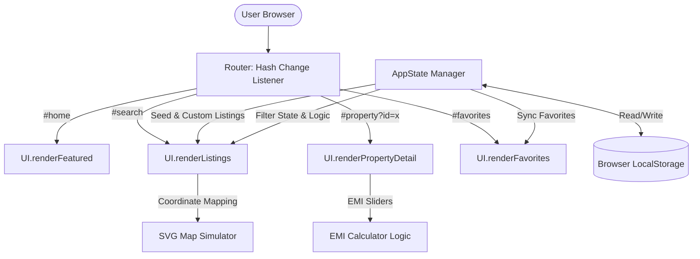

# Executive Summary & Technical Roadmap: LotLite Real Estate Portal

This document serves as a comprehensive technical summary of the **LotLite** real-estate portal prototype and details the architectural blueprint for transitioning it into a secure, production-grade, enterprise-scale platform. 

It is structured to help you present the project's current achievements, technical design decisions, and future scaling strategy to your manager.

---

## 1. Executive Summary

**LotLite** is a high-fidelity, fully responsive Single Page Application (SPA) prototype designed to demonstrate a premium real-estate portal experience (similar to *99acres* and *housing.com*). 

### Business & Engineering Value of the Prototype:
* **UX Validation**: Allows stakeholders to interact with live filters, map simulations, and loan calculators before writing backend code, reducing overall engineering risk.
* **Modern Design Tokens**: Implements a high-quality glassmorphism theme using CSS variables, designed to support light and dark modes natively.
* **Modular Front-end Code**: Structured using vanilla HTML5, CSS3, and JavaScript (ES6+), making it easy to transition to modern frameworks like React or Next.js.
* **Instant Interaction**: Achieves sub-millisecond route transitions and search filtering by executing routing and state management client-side.

---

## 2. Current Implementation: How the Website Works Today

The current prototype is designed to run efficiently in any modern browser without heavy compilation or external build steps. Below is a breakdown of the core modules:



### A. Client-Side Hash Routing
* **Implementation**: Located in `app.js` under the `Router` object. 
* **Mechanism**: It listens to browser `hashchange` events (e.g., `#home`, `#search`, `#property?id=prop-1`, `#dashboard?tab=overview`). It supports URL query parameter-based dashboard tab activation, translates tab synonyms (such as `favorites` to the internal `saved` tab), handles role-based access validation, and automatically persists/restores the last active tab state across page refreshes via `localStorage`.
* **Advantage**: Provides a Single Page Application (SPA) feel. Instead of reloading the page, JavaScript hides inactive sections (marked with class `.view-section`) and displays the active section. It also parses URL search queries to pre-fill search bars.

### B. Custom State Management (`AppState`)
* **Data Flow**: A central `AppState` class holds the master list of properties (including seeded premium Pune developments like *Kolte-Patil*, *Godrej Rivergreens*, *VTP Blue Waters*, *Panchshil Trump Towers*, and *Nyati Elysia*).
* **Search & Filters**: `AppState.getFilteredProperties()` dynamically filters records in real-time based on user preferences: purpose (Buy vs. Rent), type (Apartment, Villa, Plot, Commercial), location keyword matching, BHK size, budget slider, furnishing, and construction status.
* **Local Persistence**: 
  * **Favorites**: Saved properties are serialized to JSON and persisted in the browser's `localStorage` (via `lotlite_favorites`), remaining intact across page reloads.
  * **User Listings**: New properties posted via the "Post Property" form are appended to the dataset and persisted in `localStorage` under `lotlite_user_properties`.

### C. UI Rendering Engines (`UI`)
* **Dynamic DOM Assembly**: The `UI` object handles dynamically generating HTML cards, mapping SVG pins, loading property galleries, and injecting details.
* **Coordinate-Synced Map Simulator**: Uses custom percentages (`mapX`, `mapY`) to place coordinate markers on an interactive SVG vector map. Hovering/clicking map pins is bi-directionally linked to property listings.

### D. Interactive Calculators
* **Mortgage/EMI Calculator**: Located in the property details view. It uses real-time slider input listeners to recalculate monthly loan interest and principal amounts using standard banking formulas:
  
  $$\text{EMI} = P \times r \times \frac{(1 + r)^n}{(1 + r)^n - 1}$$
  
  *(where $P$ is principal, $r$ is monthly interest rate, and $n$ is tenure in months).*

### E. Modular Dashboard & Role-Based Layout
* **Architecture**: The dashboard operates on `#dashboard?tab=x` query parameters in the client-side router, executing a simulated 400ms skeleton loading shimmer transition on navigation.
* **CSS Panel Visibility**: Uses explicit CSS visibility tokens:
  ```css
  .dashboard-panel { display: none !important; }
  .dashboard-panel.active { display: block !important; }
  ```
  This ensures that only a single active tab renders, preventing panel overlapping or stacked listings.
* **Modular JavaScript Render API**: Built as an object-oriented rendering system on `UI`. Monolithic UI scripts are decomposed into dedicated sub-render functions: `renderDashboard()`, `renderProfile()`, `renderFavorites()`, `renderAlerts()`, `renderVisits()`, `renderMessages()`, `renderSettings()`, etc.
* **Split Visits Table Logic**: Segregates the scheduled property inspection database into distinct tables: Upcoming Site Visits (Pending/Confirmed) and Past & Completed Visits (Completed/Closed/Cancelled/Declined).

---

## 3. Future Roadmap: How the Web App Will Be Built Out

To scale LotLite from a client-side prototype to a millions-of-users production platform, the engineering stack will undergo a structured transition:

### A. Transitioning to a Framework (Next.js / React)
* **Why**: While vanilla JS is fast, it becomes hard to maintain as pages grow. 
* **Future Stack**: We will migrate to **Next.js** (React) using TypeScript.
* **Benefits**:
  * **Server-Side Rendering (SSR) & Incremental Static Regeneration (ISR)**: Essential for search engines (SEO) so property detail pages appear in search results immediately.
  * **Component Reusability**: Property cards, filter bars, and modal forms will be split into isolated, testable React components.

### B. Building the Backend Services (Node.js & Express / Python Django)
* **Why**: Currently, listings and favorites are saved locally in the browser's memory, meaning other users cannot see them.
* **Future Stack**: A RESTful or GraphQL API gateway built with Node.js/Express, NestJS, or Python FastAPI.
* **Benefits**:
  * Centralized business logic, role-based listing validation, and agent verification.

### C. Database Architecture (PostgreSQL & Redis)
* **Why**: We need a secure, scalable, and query-efficient database.
* **Future Stack**:
  * **Primary DB**: **PostgreSQL** to handle relational data (users, agents, properties, bookings).
  * **Search Engine**: **Elasticsearch** or PostgreSQL **pg_trgm** full-text search extensions for instant autocomplete and keyword-based property searches.
  * **Caching Layer**: **Redis** to cache hot property listings, active agents, and session tokens.

### D. User Authentication (Auth0 / Firebase Auth / NextAuth.js)
* **Why**: To secure agent accounts, owner postings, and user contact details.
* **Future Stack**: Integrate **NextAuth.js** or **Firebase Auth**.
* **Benefits**:
  * Support for social logins (Google, Apple) and secure Passwordless authentication.
  * Role-Based Access Control (RBAC): Differentiates between regular Buyers, verified Property Owners, and corporate Real-Estate Agents.

### E. Professional Map Integration (Google Maps API / Mapbox GL JS)
* **Why**: The current vector SVG map is simulated. A real app requires geographic routing.
* **Future Stack**: **Mapbox GL JS** or **Google Maps Javascript SDK**.
* **Benefits**:
  * Dynamic mapping using real Latitude and Longitude coordinates.
  * Draw-on-map search boundaries, radius searches (e.g., "show properties within 2km of Hinjawadi IT Park"), and neighborhood walkability scores.

### F. File & Asset Management (AWS S3 & Cloudinary)
* **Why**: Real-estate listings require multiple high-resolution photos, 3D virtual tours, and PDF floor plans.
* **Future Stack**: **AWS S3** for secure file hosting, integrated with **Cloudinary** or **Imgix** for automatic image optimization, resizing, and content delivery network (CDN) caching.

---

## 4. Architectural Transition Table

| Feature Area | Current Prototype | Future Production State | Key Benefit |
| :--- | :--- | :--- | :--- |
| **Front-End Core** | Vanilla HTML, CSS, JS | Next.js (React) + TypeScript | Better maintainability, SSR, and SEO ranking |
| **State & Data** | In-memory array (`SEED_PROPERTIES`) | PostgreSQL Database | Secure, permanent storage accessible by all users |
| **Search & Filters** | Client-side filter functions | Elasticsearch / PostgreSQL Search | Scale to millions of listings; typo tolerance |
| **Persistence** | Browser `LocalStorage` | Cloud Database + REST API APIs | User data persists across devices (mobile, laptop) |
| **Maps** | Custom SVG Vector coordinates | Mapbox GL JS / Google Maps API | Real geographical coordinates and radius filters |
| **EMI Calculator** | Client-side math listeners | Hydrated React Component | Dynamic interest rates pulled from bank APIs |
| **Media Hosting** | Local assets folder | AWS S3 bucket + CDN | Fast load times for high-res property images |
| **Deployment** | Static file hosting | Vercel (Frontend) + Docker/AWS (Backend) | 99.99% uptime, auto-scaling, CI/CD pipeline |

---

## 5. Key Talking Points for Your Manager

When presenting this project to your manager, use these structural talking points to showcase your vision:

1. **"The Prototype Validates the UX First"**
   > *"I built this high-fidelity prototype using clean Vanilla JS and CSS to prove out the user experience, layout responsiveness, and filter interactions. This gave us a working model within days without spending budget on database servers or cloud setups."*
   
2. **"Engineered for Performance and Extensibility"**
   > *"The codebase features a custom, lightweight SPA router and a centralized State Manager (`AppState`). This makes the application run instantaneously. Because the state management is separated from the UI rendering, migrating this to Next.js or React in the future will be straightforward."*
   
3. **"Clear Future Scaling Path"**
   > *"We can deploy this static version to production staging immediately. The next phase will involve replacing browser `localStorage` with a PostgreSQL database, connecting Mapbox for geographical search, and setting up user auth so owners can securely post listings."*

4. **"Aesthetic Quality Meets Industry Standards"**
   > *"The UI utilizes modern typography, smooth micro-animations, glassmorphism design tokens, and a clean, responsive layout. It matches the professional standards of top real-estate portals like 99acres and housing.com, ensuring high user trust."*
